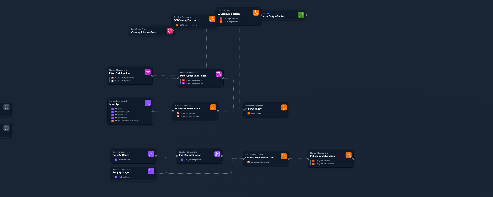

# 🎧 Mixer – Serverless Narration & Music Audio Mixer Backend


---

## ✨ Overview

**Mixer** is a production-ready, serverless audio processing backend built entirely on AWS, designed to automate the creation of professional, narration-driven audio with background music—at scale and with zero servers to manage.

Harnessing the latest in Amazon Polly Generative TTS and high-performance audio mixing (via containerized Python & FFmpeg), Mixer intelligently splits, enhances, synthesizes, and combines narration with music, producing polished MP3 output for:

*📚 **Audiobooks**

*🗣️ **Storytelling Apps**

*🎙️ **Podcasts**

* Any application needing dynamic, high-quality audio mixing
* 🎙️ Live Demo:
👉 www.dunedivision.com/speechgenerator.html

---

## 🚀 Features

* ✂️ Smart text chunking: Automatically splits long input into optimal-sized segments for Polly processing.
* ⚙️ Real-time text preprocessing: Expands abbreviations, adds SSML pauses, and optimizes narration flow.
* 🚀 Multi-threaded synthesis: Processes multiple narration chunks in parallel for faster response time.
* 🧠 Supports generative Polly voices: Leverages the latest Amazon Polly Generative TTS for natural speech.
* 🗣️ Built-in SSML enhancement: Automatically inserts <break> tags for expressive, human-like delivery.
* 🎛️ Re-encodes audio chunks for consistent, seamless quality.
* 🎙️ Concatenates narration with adjustable silences (e.g., 1-second between chunks).
* 🎵 Optional background music: Auto-looped or trimmed, volume balanced, fade-out managed.
* 🎧 Professional audio quality: Optimized narration clarity and music balance.
* ☁️ Uploads result to S3 and provides a presigned download URL.
* 🔁 Fully automated CI/CD pipeline using AWS CodePipeline and CodeBuild.
* 🌐 100% cloud-native and serverless: Scalable and cost-effective.

---

## ⚙️ Technical Overview

The Mixer project consists of multiple components:

* **Lambda Functions** (Container-based using Python & FFmpeg, Serverless Text-to-Speech Synthesizer)
* **Amazon Polly** integration for speech synthesis
* **Amazon API Gateway** for RESTful endpoints
* **Amazon S3** for file storage
* **AWS CodePipeline and CodeBuild** for CI/CD automation

See the detailed architecture documentation here:

📖 [Infrastructure & Architecture Documentation](docs/infrastructure.md)

## 🗺️ Architecture Diagram



---

## 📂 Project Structure

```
Mixer/
├── Dockerfile # Container definition for Mixer Lambda
├── app.py # Main Lambda Python logic (audio mixing)
├── buildspec.yml # AWS CodeBuild build instructions
├── requirements.txt # Python dependencies for Lambda & build
├── LICENSE # Project license (CC BY-NC 4.0)
├── README.md # Project description, usage & setup
├── IaC/ # Infrastructure as Code (CloudFormation YAML)
│ ├── MixerAppStack.yml # Lambda & API Gateway stack
│ ├── MixerInfraStack.yml # Pipeline (CodeBuild/CodePipeline/ECR) stack
│ ├── PollySpeechAPI.yml # Polly Lambda + API stack
│ └── SanitationStack.yml # Automated S3/ECR cleaning stack
└── docs/ # Documentation & architecture diagrams
├── Fullinfra.png # (optional) Full infrastructure diagram
└── infrastructure.md # Architecture documentation & instructions

```

---

## 🛠️ Infrastructure Setup

Mixer's infrastructure is fully defined and managed through AWS CloudFormation templates, providing quick, reproducible, and maintainable deployments.

Detailed instructions and direct template links:

📖 [Infrastructure & Architecture Documentation](docs/infrastructure.md)

## 🧹 Sanitation & Lifecycle Automation

As part of the Mixer platform, we deploy a serverless sanitation automation process. This system uses AWS Lambda, IAM, and EventBridge to:

- **Delete S3 files** older than a configurable threshold (default: 10 days)
- **Clean up old ECR images** (excluding the “latest” tag)
- **Run automatically** on a set schedule

This keeps storage costs low and your environment tidy—no manual cleanup required!


---

## 🔑 How to Use

**Deploy the CloudFormation stacks** described in the infrastructure documentation. Configure environment variables (`OUTPUT_BUCKET`, `MUSIC_BUCKET`, etc.) as outlined.

Invoke Mixer through its RESTful API Gateway endpoint:

```bash
curl -X POST https://your-api-endpoint/prod/mixstory \
-H "Content-Type: application/json" \
-d '{"chunk_keys": ["narration_chunks/..."], "bucket": "mixeroutputbucket", "music": "optional_music.mp3"}'
```

Mixer returns a JSON response with a presigned URL for downloading the mixed audio.

---

## 🚧 Development & Contribution

Contributions, feature requests, and bug reports are welcome!

1. **Fork the repository.**
2. **Create a feature branch.** (`git checkout -b feature/yourFeature`)
3. **Commit your changes.** (`git commit -m "Your feature description"`)
4. **Push to the branch.** (`git push origin feature/yourFeature`)
5. **Open a pull request.**

---

## 📜 License

## License

This project is released under the Creative Commons Attribution-NonCommercial 4.0 International License ([CC BY-NC 4.0](https://creativecommons.org/licenses/by-nc/4.0/)).

**You may test, deploy, and use this application for personal and evaluation purposes, but commercial use is strictly prohibited.**

If you are a recruiter and wish to see a demo or discuss commercial licensing, please contact me via [LinkedIn](https://www.linkedin.com/in/ghassen-rabii-32764b36a) or [email](nnotsgg@gmail.com).


---

🌟 **Happy Mixing!** 🌟
